# Semantic Navigation Prototype

A closed-loop mobile robot navigation prototype built in Gazebo Fortress with C++ and Gazebo Transport.

The project implements odometry-based motion control for a differential-drive mobile robot. It progresses from basic velocity commands to closed-loop distance control, yaw control, point-to-point navigation, trajectory logging, and multi-case benchmark evaluation.

## Project Highlights

- Differential-drive mobile robot simulation in Gazebo Fortress
- C++17 control programs using Gazebo Transport
- Real-time odometry feedback for position `(x, y)` and heading `yaw`
- Closed-loop distance control
- Closed-loop 90-degree left and right turns
- Relative point-to-point navigation
- CSV trajectory logging and Python visualization
- Six-case continuous relative-navigation benchmark
- Known-map A* obstacle detour planning with safety inflation and waypoint execution
- Pose goal navigation with final yaw alignment

## Technical Stack

| Component | Configuration |
|---|---|
| Host OS | Windows |
| Linux environment | WSL2 |
| Ubuntu | 22.04.5 LTS |
| Robotics middleware | ROS 2 Humble |
| Simulator | Gazebo Fortress / Ignition Gazebo |
| Main language | C++17 |
| Visualization | Python + Matplotlib |
| Robot model | Differential-drive wheeled robot |

## Core Capabilities

### 1. Closed-Loop Distance Control

The robot reads odometry feedback and adjusts its forward speed based on the remaining distance to the goal.

Example result:

    Target distance: 0.500 m
    Actual distance: 0.498 m
    Absolute error: 0.002 m

### 2. Closed-Loop Yaw Control

The controller converts the odometry quaternion into yaw and continuously adjusts angular velocity according to the remaining heading error.

Validated 90-degree turning results:

    Left turn:
    Actual turn: 90.40 degrees
    Final angle error: 0.40 degrees

    Right turn:
    Actual turn: -89.44 degrees
    Final angle error: 0.56 degrees

### 3. Closed-Loop Point-to-Point Navigation

The robot continuously performs:

    compute target heading
    -> rotate in place until aligned
    -> move forward toward the target
    -> re-check odometry and correct heading
    -> stop inside the goal tolerance

A relative target can be specified as:

    forward distance (m)
    left offset (m)

Example command:

    ~/semantic_nav_ws/tools/drive_blue_goto rel 0.40 0.30

Example result:

    Initial target distance: 0.500 m
    Final target error: 0.002 m

## Trajectory Logging and Visualization

During navigation, the system records the following data into CSV:

- time
- world x and y position
- yaw angle
- target position
- distance to goal
- heading error
- linear velocity
- angular velocity
- current control mode

A Python script visualizes the actual trajectory, start point, target point, and final point.

### Single Navigation Trajectory

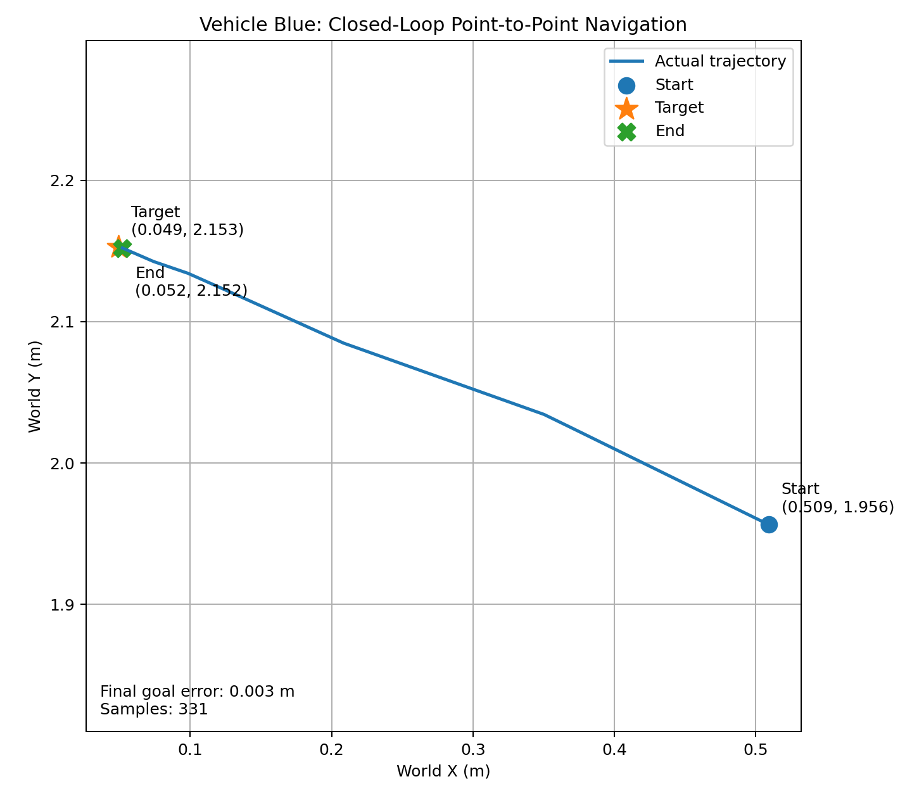

## Multi-Case Navigation Benchmark

Six continuous relative-navigation tasks were executed without resetting the robot between cases.

| Case | Relative target | Final error |
|---|---:|---:|
| case01_straight_030 | forward 0.30 m | 4.97 mm |
| case02_left_030_020 | forward 0.30 m, left 0.20 m | 8.45 mm |
| case03_right_030_020 | forward 0.30 m, right 0.20 m | 8.88 mm |
| case04_straight_050 | forward 0.50 m | 5.29 mm |
| case05_left_040_030 | forward 0.40 m, left 0.30 m | 3.79 mm |
| case06_right_040_030 | forward 0.40 m, right 0.30 m | 5.02 mm |

Benchmark summary:

    Average final error: approximately 6.07 mm
    Maximum final error: approximately 8.88 mm
    Goal tolerance: 25 mm

### Final Goal Error Comparison

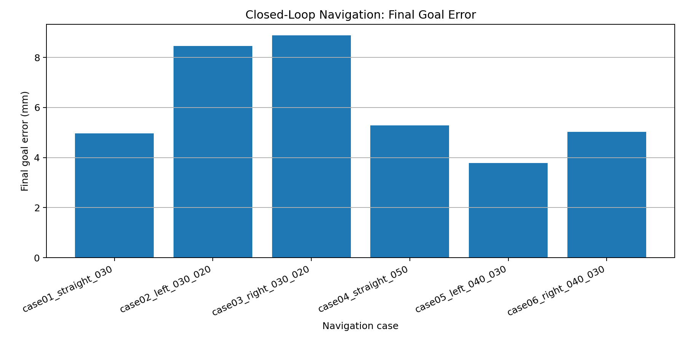

### Six Continuous Navigation Trajectories

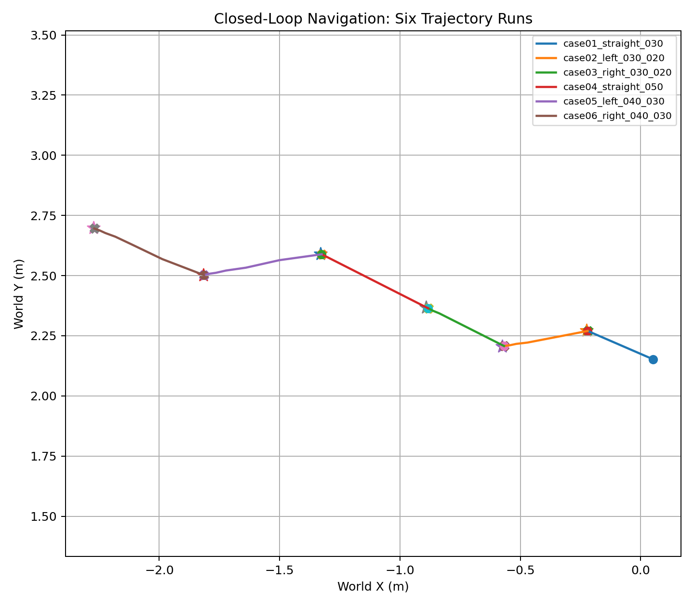

## Repository Structure

    semantic_nav_ws/
    ├── README.md
    ├── docs/
    │   └── PROJECT_LOG.md
    ├── tools/
    │   ├── drive_blue.cpp
    │   ├── drive_blue_distance.cpp
    │   ├── drive_blue_distance_slow.cpp
    │   ├── drive_blue_yaw.cpp
    │   ├── drive_blue_goto.cpp
    │   ├── drive_blue_goto_trace.cpp
    │   ├── plot_trajectory.py
    │   ├── run_navigation_benchmark.sh
    │   └── summarize_benchmark.py
    └── outputs/
        ├── exp009_rel_040_030/
        └── benchmark_rel_v1/
            ├── manifest.csv
            └── summary/
                ├── benchmark_summary.csv
                ├── final_error_comparison.png
                └── trajectory_overlay.png

## Build

The control programs use Gazebo Transport and Ignition message libraries.

Example build command:

    g++ -std=c++17 -O2 \
      ~/semantic_nav_ws/tools/drive_blue_goto.cpp \
      -o ~/semantic_nav_ws/tools/drive_blue_goto \
      $(pkg-config --cflags --libs ignition-transport11 ignition-msgs8)

## Run

Start the Gazebo differential-drive demo first:

    source /opt/ros/humble/setup.bash
    export LIBGL_ALWAYS_SOFTWARE=1
    ros2 launch ros_gz_sim_demos diff_drive.launch.py rviz:=false

Examples:

    ~/semantic_nav_ws/tools/drive_blue_yaw left90
    ~/semantic_nav_ws/tools/drive_blue_yaw right90

    ~/semantic_nav_ws/tools/drive_blue_goto rel 0.40 0.30

    ~/semantic_nav_ws/tools/drive_blue_goto_trace rel 0.40 0.30
    python3 ~/semantic_nav_ws/tools/plot_trajectory.py

    ~/semantic_nav_ws/tools/run_navigation_benchmark.sh
    python3 ~/semantic_nav_ws/tools/summarize_benchmark.py

## EXP-011: Multi-Waypoint Route Execution

The verified closed-loop point-to-point controller was reused as a
single-waypoint executor and scheduled sequentially to complete a
four-waypoint route. Each segment used odometry feedback to align,
move, correct heading, and stop within the goal tolerance.

| Waypoint | Relative target | Final error |
|---|---|---:|
| wp01_forward_035 | forward 0.35 m | 10.55 mm |
| wp02_left_035 | forward 0.00 m, left 0.35 m | 5.68 mm |
| wp03_forward_035 | forward 0.35 m | 10.80 mm |
| wp04_right_035 | forward 0.00 m, right 0.35 m | 8.00 mm |

Waypoint-route summary:

    Average final waypoint error: 8.76 mm
    Maximum final waypoint error: 10.80 mm
    Goal tolerance: 25 mm

All four waypoints reached the specified stopping tolerance.

### Waypoint Error Comparison

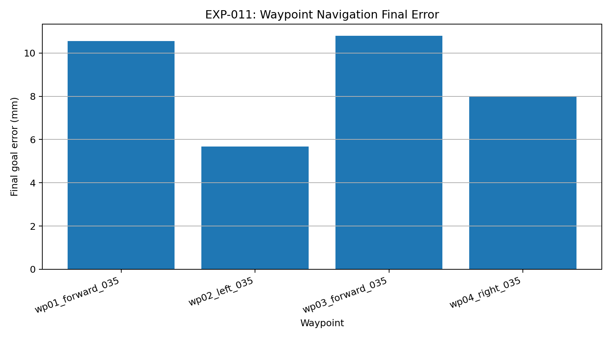

### Multi-Waypoint Route Overview

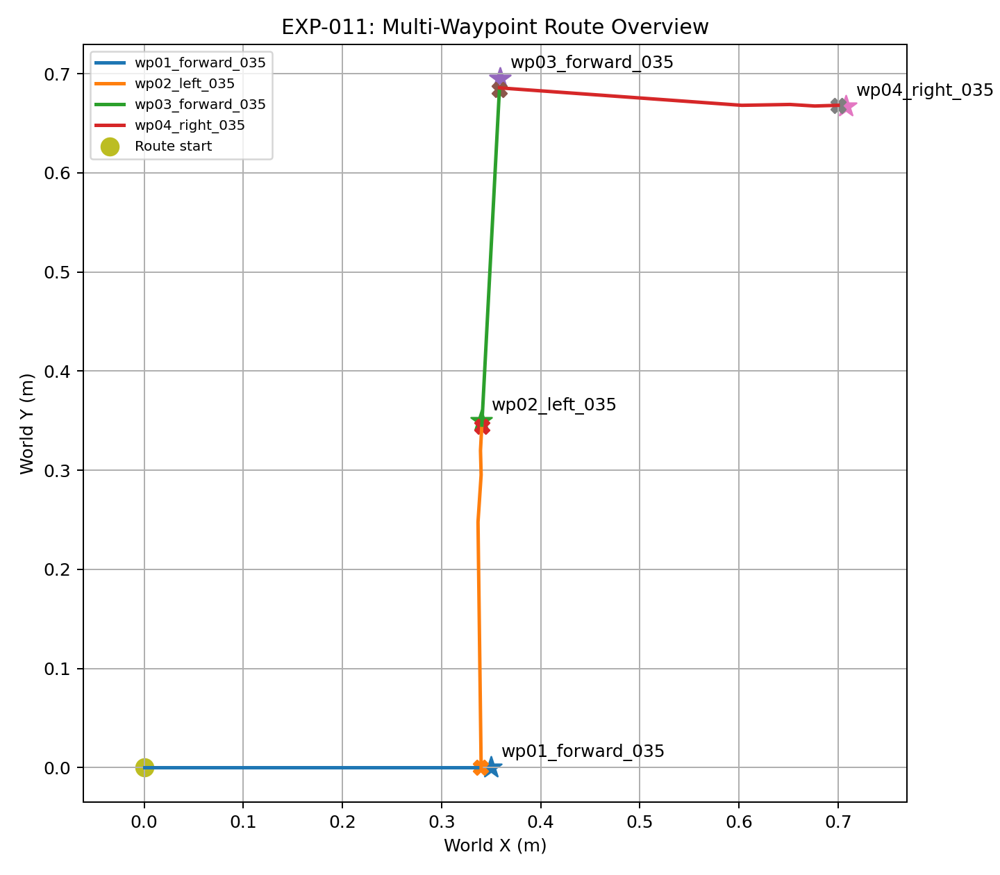

<!-- EXP012_START -->
## EXP-012: CSV-Driven Fixed Odom-Frame Route

This experiment upgrades the route interface from relative motion commands
to a CSV-defined sequence of fixed odometry-frame waypoints.

The C++ controller loads the entire route in one process and uses odometry
feedback to repeatedly align, move, correct heading, and stop at each target.

| Waypoint | Target coordinate | Final error | Duration | Status |
|---|---:|---:|---:|---|
| wp01_north | (0.70, 1.00) | 3.55 mm | 9.00 s | success |
| wp02_west | (0.35, 1.00) | 9.26 mm | 10.46 s | success |
| wp03_south | (0.35, 0.65) | 7.91 mm | 10.45 s | success |
| wp04_east | (0.70, 0.65) | 13.74 mm | 10.47 s | success |

Route summary:

    Success rate: 4 / 4
    Average final waypoint error: 8.62 mm
    Maximum final waypoint error: 13.74 mm
    Goal tolerance: 25 mm
    Total execution time: 40.39 s

Coordinate frame: all EXP-012 route targets are expressed in `vehicle_blue/odom`, initialized when the simulator starts.

This is pre-defined fixed odometry-frame waypoint execution, not yet
map-based global path planning or obstacle-aware navigation.

### Fixed Odom-Frame Route Waypoint Error

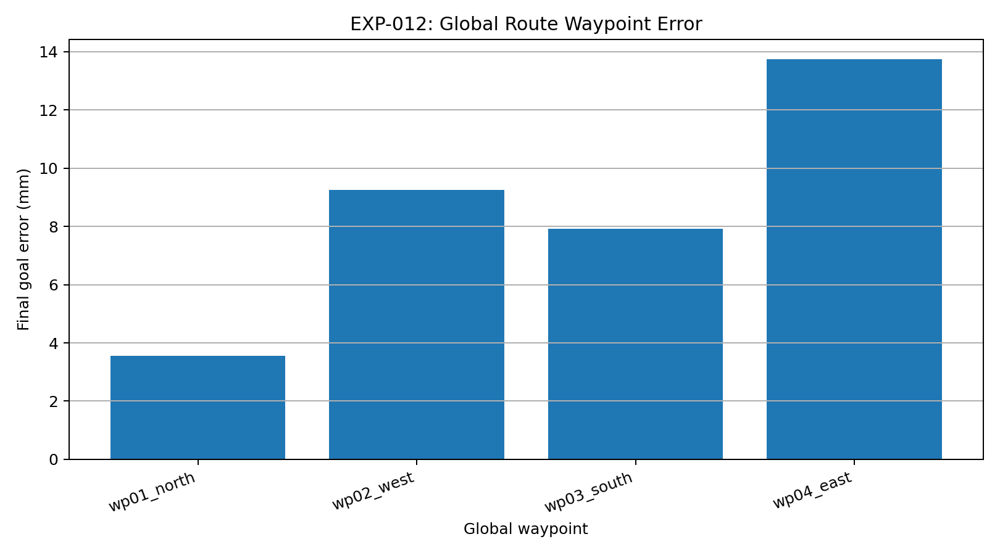

### Fixed Odom-Frame Route Overview

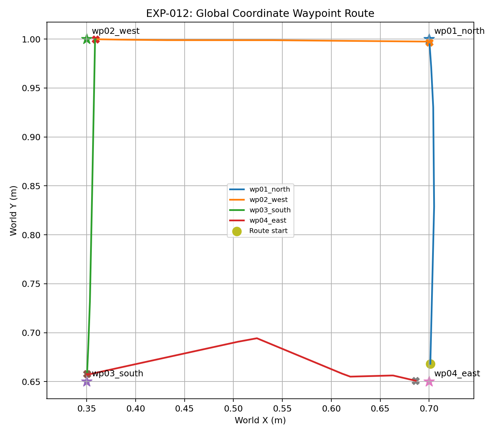

<!-- EXP012_END -->

<!-- EXP013_START -->
## EXP-013: Static-Obstacle Detour in a Fixed Odom Frame

A custom Gazebo world was created with a static rectangular obstacle.
The controller executed a predefined fixed odometry-frame waypoint route
that moved above the obstacle, crossed to its right side, and reached the
final target region.

The route is expressed in `vehicle_blue/odom`, not Gazebo absolute world
coordinates. The obstacle world pose was converted into the same odometry
frame for consistent visualization.

| Waypoint | Odom-frame target | Final error | Duration | Status |
|---|---:|---:|---:|---|
| wp01_move_north | (0.00, 4.40) | 21.46 mm | 33.83 s | success |
| wp02_pass_above_obstacle | (5.50, 4.40) | 23.23 mm | 40.47 s | success |
| wp03_goal_right | (5.50, 2.00) | 20.10 mm | 21.42 s | success |

Detour-route summary:

    Success rate: 3 / 3
    Average final waypoint error: 21.60 mm
    Maximum final waypoint error: 23.23 mm
    Goal tolerance: 25 mm
    Total execution time: 95.72 s

This experiment demonstrates predefined waypoint detour execution in a
static-obstacle environment. It does not yet include obstacle sensing,
automatic path search, online replanning, or autonomous collision avoidance.

### Static-Obstacle Detour Error

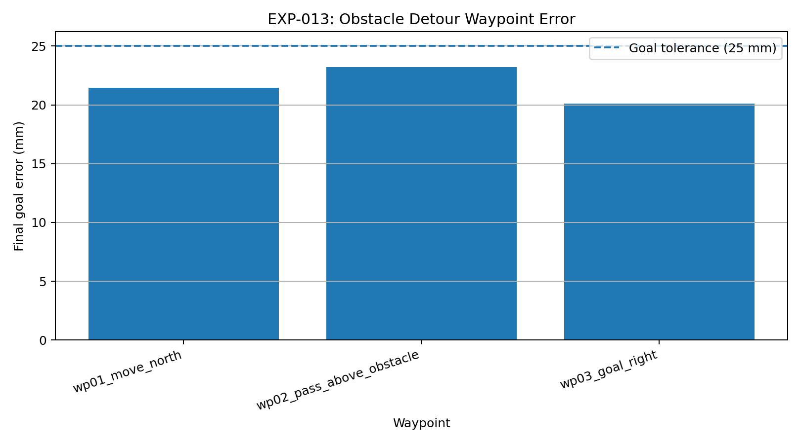

### Fixed Odom-Frame Detour Route

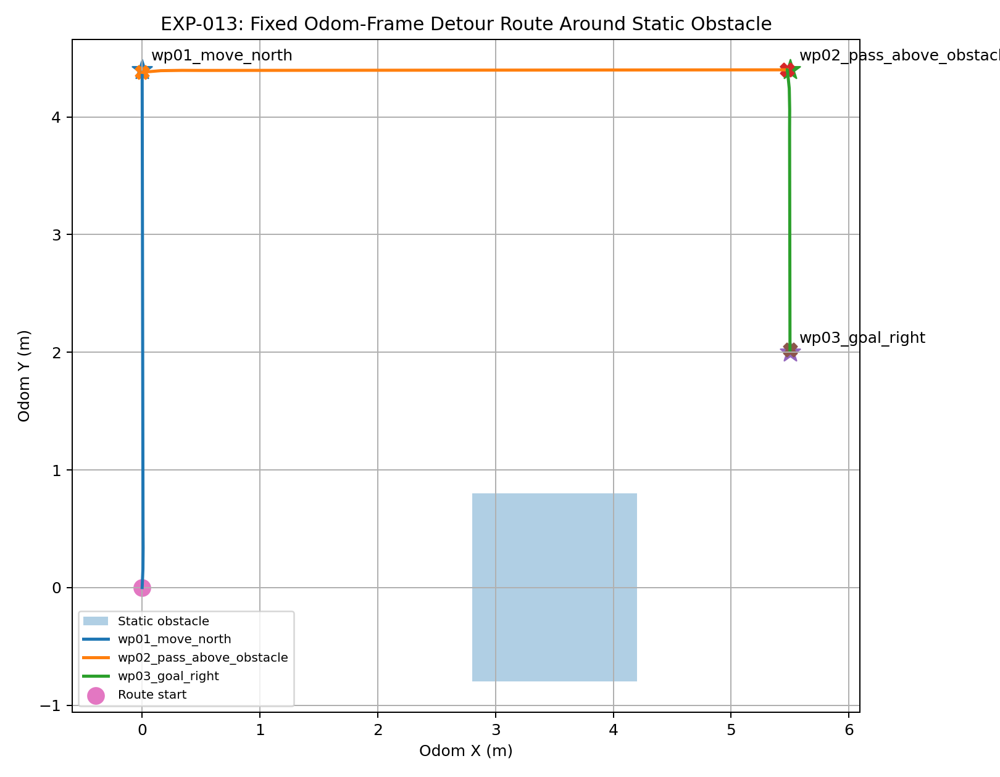

<!-- EXP013_END -->

## EXP-014: A* Known-Map Obstacle Detour Planning

EXP-014 extends the static-obstacle experiment from hand-written detour waypoints to a simple known-map A* planning pipeline.

The experiment first treats the robot as a point and generates a short A* route around the known obstacle. Although V1 reaches the target numerically, the robot body and wheels pass too close to the obstacle in simulation. V2 increases the obstacle safety inflation radius and keeps more intermediate waypoints, producing a safer executable route.

### Key Result

| Version | Controller waypoints | Success rate | Max final error | Qualitative result |
|---|---:|---:|---:|---|
| V1 | 2 | 2 / 2 | 24.46 mm | Reached target, but passed too close to the obstacle |
| V2 | 9 | 9 / 9 | 22.10 mm | Safely detoured around the obstacle |

V2 stays within the 25 mm waypoint tolerance while avoiding visible contact with the obstacle.

### Route Comparison

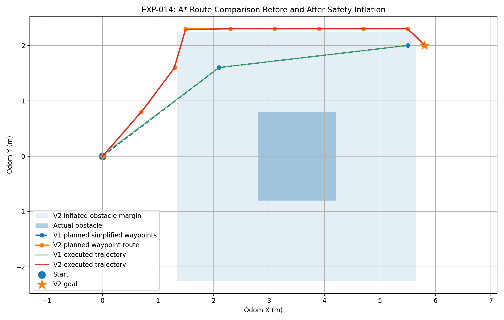

### Final Error Comparison

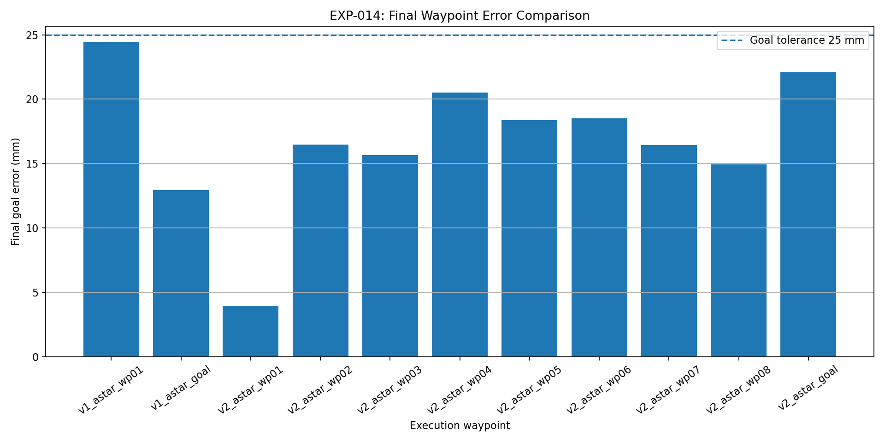

### Interpretation

EXP-014 shows that endpoint accuracy alone is not enough for safe navigation. A point-robot A* plan can satisfy final waypoint error thresholds but still be unsafe for a real robot body. Adding obstacle inflation and denser intermediate waypoints improves execution safety in the Gazebo static-obstacle scene.

Current scope: known static map, offline A* planning, and odom-frame waypoint tracking. It does not yet include online sensing, dynamic obstacle avoidance, costmap-based planning, or Nav2 integration.

## EXP-015: Pose Goal Navigation with Final Yaw Alignment

EXP-015 extends waypoint navigation from position-only goals to pose goals. Each waypoint contains `target_x`, `target_y`, and `target_yaw_deg`. The controller first drives the robot to the target position, then performs an in-place final yaw alignment.

### Key Result

| Metric | Result |
|---|---:|
| Success rate | 9 / 9 |
| Max final position error | 19.90 mm |
| Average final position error | 11.86 mm |
| Max final yaw error | 2.21 deg |
| Average final yaw error | 0.61 deg |
| Total execution time | 105.16 s |

Final pose goal:

| Item | x | y | yaw |
|---|---:|---:|---:|
| Target | 5.800 | 2.000 | 0.00 deg |
| Actual | 5.797 | 2.003 | 1.15 deg |

The final goal reached 4.47 mm position error and 1.15 deg yaw error, staying within the 25 mm position tolerance and 3 deg yaw tolerance.

### Pose Route Overview

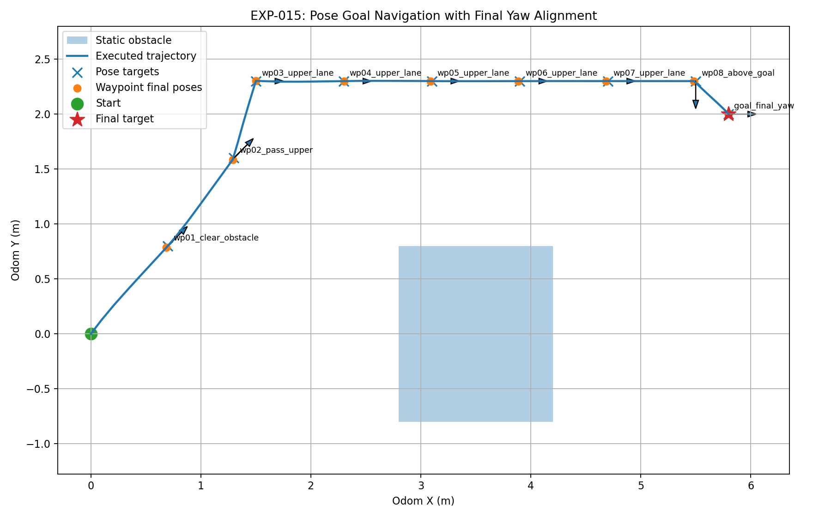

### Position and Yaw Error Summary

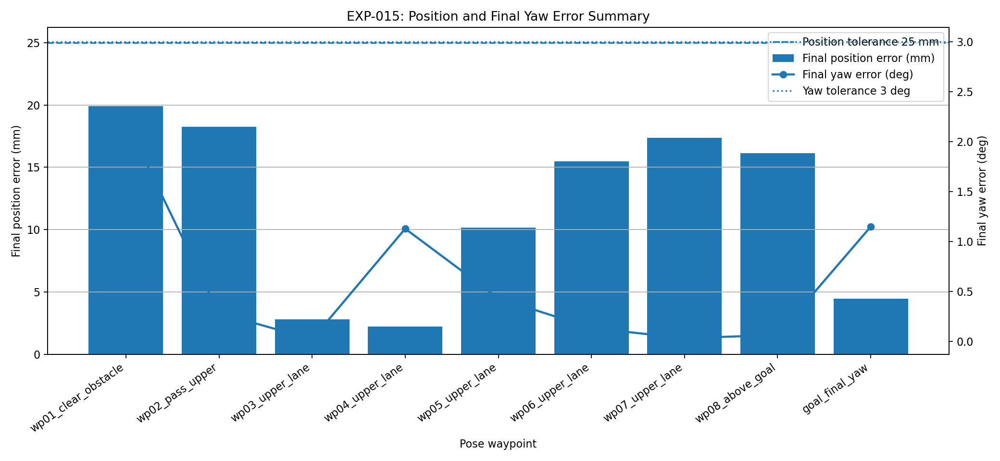

### Interpretation

This experiment validates pose goal execution in the obstacle world: the robot can reach a target position and then align its final heading. It does not target lane-change or overtaking-style return-to-lane behavior; the goal is general mobile robot pose navigation.

## Current Limitations and Next Steps

The current benchmark is a continuous relative-navigation test, meaning that each case starts from the previous case's final pose. Future work includes:

- independent repeated trials from fixed initial poses
- waypoint-sequence navigation
- online obstacle sensing, costmap-based planning, and dynamic collision avoidance
- integration with ROS 2 navigation tools
- visual perception and semantic navigation
- simulation-to-real transfer to wheeled robot platforms
